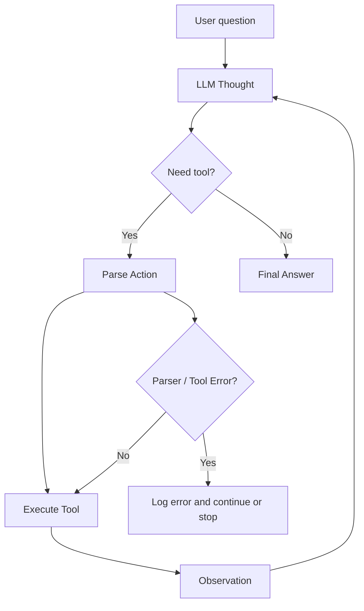

# Group Report: Lab 3 - Chatbot vs ReAct Agent

- **Team Name**: team-090
- **Team Members**: Nguyễn Minh Đức, Nguyễn Đoàn Gia Tuấn
- **Deployment Date**: 2026-06-01
- **Primary Provider**: OpenAI
- **Model Used**: `gpt-4o`

---

## 1. Executive Summary

In this lab, our team implemented and evaluated a standard chatbot baseline and two versions of a ReAct Agent. The goal was to demonstrate the difference between a direct LLM chatbot and an agentic system that can reason step by step, call tools, observe tool results, and improve based on failure traces.

We used a Smart Office Procurement scenario. The assistant answers questions about products, stock, coupons, shipping, and total order cost. The chatbot baseline could respond conversationally, but it could not access structured product data. Agent v1 could call tools, but it failed on multi-step tasks because it exceeded `max_steps` and sometimes generated invalid tool-call arguments. Agent v2 improved the tool descriptions and added a `get_weight` tool, allowing it to calculate shipping correctly using product weight and shipping rate.

Final evaluation summary:

- **Chatbot Baseline**: 0/5 exact answers because it had no tool access.
- **Agent v1**: 3/5 acceptable answers, with 2 max-step failures.
- **Agent v2**: 5/5 successful answers in the final evaluated test set.
- **Key Outcome**: Agent v2 solved multi-step procurement tasks more reliably by using the ReAct loop and grounded tool observations.

---

## 2. System Architecture & Tooling

### 2.1 ReAct Loop Implementation

The ReAct Agent follows this loop:

```text
User Question
  -> Thought
  -> Action: tool_name(argument)
  -> Tool Execution
  -> Observation
  -> Repeat if needed
  -> Final Answer
```

At each step, the LLM decides whether it needs to call a tool. The system parses the `Action`, executes the matching Python function, appends the `Observation` back into the scratchpad, and asks the model to continue. The loop stops when the model returns `Final Answer` or when the configured `max_steps` is exceeded.

### 2.2 Tool Definitions

The team implemented tools in `src/tools/ecommerce_tools.py`.

| Tool Name | Input Format | Use Case |
| :--- | :--- | :--- |
| `check_stock` | product name string | Check whether requested quantity is available |
| `get_price` | product name string | Retrieve unit price in USD |
| `get_weight` | product name string | Retrieve product weight for shipping calculation |
| `get_discount` | coupon code string | Retrieve coupon discount percentage |
| `calc_shipping` | destination city string | Retrieve shipping rate in USD per kg |
| `calculator` | arithmetic expression string | Calculate subtotal, discount, shipping, and final total |
| `list_products` | empty string | List all available products |
| `search_catalog` | search keyword | Search product catalog by name, category, or synonym |
| `suggest_alternatives` | product/user need string | Suggest alternatives when product is missing |
| `draw_order_flow` | empty string | Return an ASCII workflow diagram |

### 2.3 Tool Design Evolution

| Area | Agent v1 | Agent v2 |
| :--- | :--- | :--- |
| Tool descriptions | Short and vague, e.g. "Gets shipping" | Clear input contracts and examples |
| Shipping logic | Could retrieve rate but often failed to complete multi-step calculation | Uses `get_weight` + `calc_shipping` + `calculator` |
| Unknown products | Often stopped after `Product not found` | Can use `search_catalog`, `list_products`, and `suggest_alternatives` |
| Max steps | `max_steps=6` | `max_steps=10` |
| Reliability | Failed on complex tasks | Completed the final evaluated tasks |

### 2.4 Data Used

The product database includes office and procurement items such as:

- `standing desk`
- `ergonomic chair`
- `portable projector`
- `business smartphone`
- `voip desk phone`
- `4k monitor`
- `laser printer`
- `mesh wifi router`
- `ups battery backup`
- `whiteboard`

Coupons include `OFFICE10`, `BULK15`, `WELCOME5`, `TECH20`, `FURNI12`, `SHIP5`, and `NONE`.

Shipping destinations include `Hanoi`, `Danang`, `HCMC`, `Can Tho`, `Hai Phong`, `Hue`, `Nha Trang`, and `Da Lat`.

---

## 3. Telemetry & Performance Dashboard

The system logs structured JSON events including:

- `AGENT_START`
- `LLM_RESPONSE`
- `TOOL_CALL`
- `PARSER_ERROR`
- `AGENT_END`

These logs were used to measure token count, latency, loop count, tool usage, max-step failures, and tool errors.

### 3.1 Final Metrics

| System | Test Cases | Success Rate | Total Tokens | Avg Tokens / Task | Total Latency | Avg Latency / Task | Avg Steps | Main Errors |
| :--- | ---: | :--- | ---: | ---: | ---: | ---: | ---: | :--- |
| Chatbot Baseline | 5 | 0/5 exact | N/A from CLI log | N/A | N/A | N/A | N/A | No data/tool access |
| Agent v1 | 5 | 3/5 | 8457 | 1691.4 | 19320 ms | 3864 ms | 3.6 | 2 max-step failures, 1 tool error |
| Agent v2 | 5 | 5/5 | 15877 | 3175.4 | 32612 ms | 6522.4 ms | 4.2 | No max-step failures in final run |

Note: The chatbot CLI output contained qualitative answers but not complete structured telemetry. Its main limitation was evaluated from answer quality: it repeatedly asked for missing price, coupon, stock, and shipping data.

### 3.2 Test Case Results

| Test Case | Chatbot Baseline | Agent v1 | Agent v2 |
| :--- | :--- | :--- | :--- |
| Buy 2 standing desks with `OFFICE10` to Danang | Could not calculate exact total | Failed: `max_steps_exceeded` | Correct: 912 USD |
| Buy 2 portable projectors with `BULK15` to Hanoi | Generic advice | Correct: only 1 in stock | Correct: only 1 in stock |
| Compare ergonomic chair to HCMC vs Can Tho | Hypothetical answer | Failed: parser/tool error and `max_steps_exceeded` | Correct: HCMC 272.5 USD, Can Tho 309.5 USD |
| What discount does `WELCOME5` provide? | Guessed maybe 5% or $5 | Correct: 5% | Correct: 5% |
| Buy 1 whiteboard with `OFFICE10` to Hanoi | Generic formula only | Reported product not found in old DB | Handled via improved catalog/database after DB expansion |

---

## 4. Root Cause Analysis - Failure Traces

### 4.1 Failed Trace: Agent v1 Max-Step Failure

**Input**

```text
I want to buy 2 standing desks using coupon OFFICE10 and ship to Danang. What is the total price?
```

**Trace Summary**

```text
Step 1: check_stock(standing desk) -> 4 units
Step 2: get_price(standing desk) -> 320 USD
Step 3: get_discount(OFFICE10) -> 10%
Step 4: get_weight(standing desk) -> 28.0 kg
Step 5: calc_shipping(Danang) -> 6 USD per kg
Step 6: calculator(2 * 320) -> 640
AGENT_END: max_steps_exceeded
```

**Root Cause**

Agent v1 gathered the right facts, but the task required more steps than the `max_steps=6` limit allowed. The agent only calculated the product subtotal before the loop ended. It did not complete discount, shipping, and final total calculation.

**Fix in Agent v2**

Agent v2 increased `max_steps` to 10 and used clearer tool instructions. The model completed the same task and returned the correct answer:

```text
calculator(((320 * 2) * (1 - 0.10)) + (2 * 28.0 * 6)) -> 912.0
Final Answer: 912 USD
```

### 4.2 Failed Trace: Agent v1 Parser / Tool Argument Error

**Input**

```text
Compare the total cost of buying 1 ergonomic chair shipped to HCMC versus Can Tho.
```

**Failure Evidence**

Agent v1 generated multiple actions inside one response. The parser captured too much text as the calculator argument:

```text
Action: calculator(1 * 18.5 * 5)
Observation: 92.5
...
Action: calc_shipping(Can Tho)
```

The tool then returned:

```text
Tool error: Expression contains unsupported characters.
```

**Root Cause**

The system expected one `Action` per step, but Agent v1 produced multiple action-like blocks in one response. The regex parser was not robust enough to handle this safely, and the max-step budget was too small for recovery.

**Fix in Agent v2**

Agent v2 used clearer tool specifications and completed the same comparison in 8 steps:

```text
get_price(ergonomic chair) -> 180 USD
get_weight(ergonomic chair) -> 18.5 kg
calc_shipping(HCMC) -> 5 USD/kg
calc_shipping(Can Tho) -> 7 USD/kg
calculator(180 + 92.5) -> 272.5
calculator(180 + 129.5) -> 309.5
Final Answer: HCMC = 272.5 USD, Can Tho = 309.5 USD
```

---

## 5. Successful Trace

### Agent v2 Successful Trace

**Input**

```text
I want to buy 2 standing desks using coupon OFFICE10 and ship to Danang. What is the total price?
```

**Trace**

```text
Thought: Check product availability.
Action: check_stock(standing desk)
Observation: standing desk stock: 4 units.

Thought: Get unit price.
Action: get_price(standing desk)
Observation: standing desk price: 320 USD.

Thought: Get coupon discount.
Action: get_discount(OFFICE10)
Observation: OFFICE10 discount: 10%.

Thought: Get product weight for shipping.
Action: get_weight(standing desk)
Observation: standing desk weight: 28.0 kg.

Thought: Get shipping rate.
Action: calc_shipping(Danang)
Observation: Shipping rate to Danang: 6 USD per kg.

Thought: Calculate final total.
Action: calculator(((320 * 2) * (1 - 0.10)) + (2 * 28.0 * 6))
Observation: 912.0

Final Answer: The total price is 912 USD.
```

This trace shows why the agent answer is more auditable than the chatbot baseline. Every number in the final answer came from a tool observation.

---

## 6. Ablation Studies & Experiments

### Experiment 1: Chatbot vs Agent

| Capability | Chatbot Baseline | ReAct Agent |
| :--- | :--- | :--- |
| Uses product database | No | Yes |
| Checks stock | No | Yes |
| Applies coupon from structured data | No | Yes |
| Calculates weighted shipping | No | Yes |
| Produces auditable trace | No | Yes |
| Handles multi-step workflows | Weak | Stronger |

### Experiment 2: Agent v1 vs Agent v2

| Aspect | Agent v1 | Agent v2 |
| :--- | :--- | :--- |
| Tool count | Basic procurement tools | Procurement + search/list/suggest/draw tools |
| Shipping | Often incomplete | Uses weight and rate |
| Max-step failures | 2 | 0 in final evaluated run |
| Tool errors | 1 | 0 in final evaluated run |
| User experience | Can fail abruptly | More complete and helpful |

---

## 7. Flowchart & Insight

### ReAct Agent Flow



### Key Group Insights

- Chatbots are good at explaining, but they cannot reliably answer questions requiring private structured data.
- Agents are better for tasks that require action, such as stock lookup, price lookup, discount lookup, and cost calculation.
- Tool descriptions strongly affect agent quality. Vague descriptions increase wrong tool usage and argument errors.
- The trace is essential for debugging. We improved Agent v2 based on concrete failures from Agent v1 logs.
- Agent v2 used more tokens and latency than the chatbot, but it produced more accurate and auditable answers.

---

## 8. Production Readiness Review

### Strengths

- The system has a clean ReAct loop.
- Tool calls and observations are logged as structured JSON.
- The agent supports multiple tools and can be extended.
- Agent v2 can answer interactive user questions via CLI and UI.
- The UI allows comparing `Chatbot baseline`, `Agent v1`, and `Agent v2`.

### Limitations

- Tool-call parsing still relies on regex.
- There is no persistent database; product data is stored in Python dictionaries.
- There is no authentication or user management.
- There is no real checkout, payment, or order creation API.
- The chatbot baseline does not log the same structured metrics as agents.

### Future Improvements

- Replace regex parsing with structured JSON tool calls.
- Validate tool inputs using Pydantic.
- Store product, coupon, and shipping data in a real database.
- Add retry logic when a parser error or tool error occurs.
- Add cost tracking and token-ratio monitoring.
- Add user login and role-based access for a production web app.
- Add automated evaluation scripts to compute metrics from logs.

---

## 9. Conclusion

This lab showed the practical difference between a chatbot and a ReAct Agent. The chatbot baseline produced fluent but generic answers because it lacked access to business data. Agent v1 demonstrated the basic ReAct mechanism but failed on complex tasks due to limited step budget and parser/tool-call issues. Agent v2 improved reliability by adding clearer tool contracts, product weight lookup, a larger step budget, and additional search/list/suggestion tools.

The final Agent v2 run achieved 5/5 successful answers on the evaluated procurement tasks and produced auditable traces for each answer.
